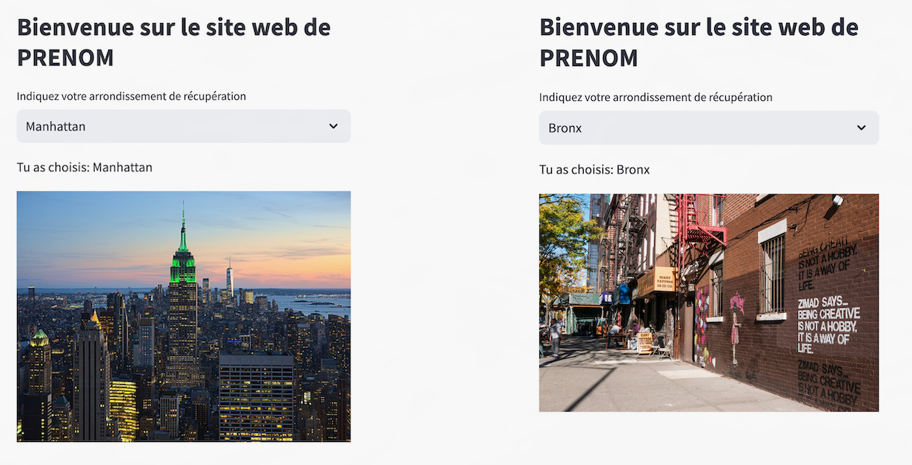
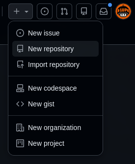
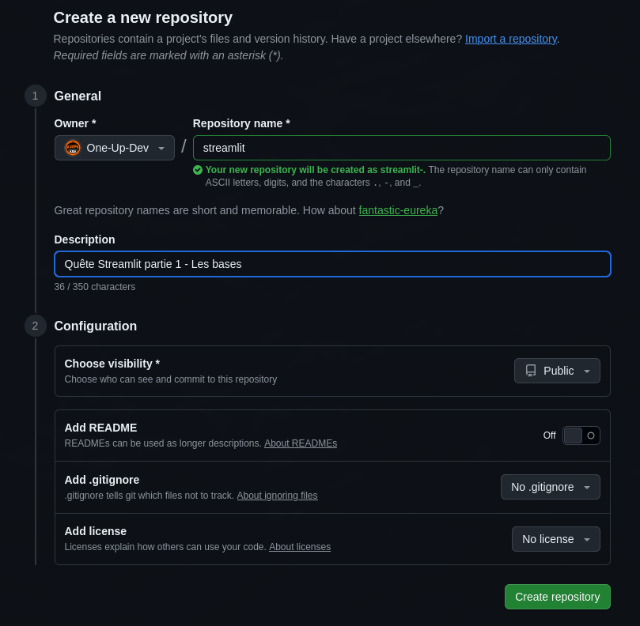

---
# **`Challenge`** 

---
## Crée une application Streamlit qui ressemblera aux images ci-dessous :



---

- Vous changerez la variable PRENOM du titre par votre prénom à vous.

- Vous utiliserez le dataset taxis

- L'utilisateur pourra choisir un arrondissement de récupération. En fonction du choix de l'arrondissement l'image se modifiera (les images peuvent être différentes de l'exemple).

- Vous mettrez le code dans un notebook et partagerez le lien en lecture.

---
## **Méthodologie**

- création d'un environnement virtuel

```bash
mkdir streamlit && cd streamlit
python3 -m venv myenv
source myenv/bin/activate
```

```bash
pip install streamlit seaborn
```

- création du fichier de versionning
```bash
git init
```


- création du fichier python
```bash
nvim app.py
```
```python3
import streamlit as st
import pandas as pd
import seaborn as sns

taxis = sns.load_dataset("taxis")


c1 = st.container()
c1.title("Bienvenue sur le site de Fabrice",text_alignment='center')
c = st.container(border=True, horizontal_alignment='center')
choix = c.selectbox("Indiquez votre arrondissement de récupération", taxis['pickup_borough'].unique())


if choix == "Bronx":
    c.write(f"Tu as choisi : {choix}")
    c.image("images/bronx.jpg")
elif choix == "Queens":
    c.write(f"Tu as choisi : {choix}")
    c.image("images/queens.jpg")
elif choix == "Manhattan":
    c.write(f"Tu as choisi : {choix}")
    c.image("images/manhattan.jpg")
elif choix == "Brooklyn":
    c.write(f"Tu as choisi : {choix}")
    c.image("images/brooklyn.jpg")
else:
    c.write(f"Fais ton choix")
    c.image("images/nan.jpg")

st.page_link("https://github.com/One-Up-Dev/streamlit/tree/main", label="Code Source", icon=":material/code_blocks:")
```


- Création du fichier README.md
```bash
nvim README.md
```


- Déploiement github


  

```bash
git remote add origin https://github.com/One-Up-Dev/streamlit.git
git branch -M main
git push -u origin main
```


```bash
git add .
git commit -m "mon message"
git push
```
---
## **Erreur rencontrer**

### **Problème au niveau du déploiement sur streamlit**
seaborn.load_dataset() essaie de créer un dossier de cache local
*Solution* : Charger le dataset directement avec *Pandas*  
Avant :
```python
taxis = sns.load_dataset("taxis")
```
Après :
```python
url = "https://raw.githubusercontent.com/mwaskom/seaborn-data/master/taxis.csv"
taxis = pd.read_csv(url)
